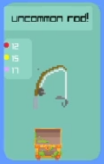

import {Aside, LinkButton, Steps} from "@astrojs/starlight/components";
import Dot from "../../components/Dot.astro";
import FishSpeciesOverview from "../../components/FishSpeciesOverview.astro";

a cat girl needs her fish snack - nya

<Aside type="caution">
    The fishing game is in active development and the mechanics may change on a
    daily basis.
    Use this documentation with caution, as it may very well be out-of-date.
</Aside>

## Prerequisites

In order to play the fishing game, the player needs a rod.

<LinkButton href="/redeems/#test-rod-lvl-1" icon="right-arrow" iconPlacement="start">Test Rod LVL 1</LinkButton>

## How to play

<Steps>
    1. Meet all [prerequisites](#prerequisites)
    2. Use the [`!fish` command](/commands/#fishing)
    3. See what fish you caught [in the stream](https://www.twitch.tv/just__jane/).
</Steps>

## Battle Phases

To catch a fish, you must win against the fish across three challenges.
Just like in real fishing.

These steps will play out in real time before your very eyes:

<Steps>
    1. **Lure:** First and foremost, the lure must be alluring to the fish.
       Fish have varied taste and some fish are more cunning than others.
    2. **Hook:** An interested fish will take a bite, but it might escape the
       hook if it succeeds its saving though.
    3. **Line:** This is where the real battle begins.
       A test of strength and stamina occurs until either the fish gets away, or
       you reel it in.
</Steps>

Complete all three steps and you got yourself a new fish!

## Species

The following fish species can be caught.

<FishSpeciesOverview />

<Aside type="note">
    The fish art seen on stream and in this documentation is temporary and used
    as a placeholder.

    Temporary fish art by https://pixerelia.itch.io/lets-go-fishing
</Aside>

## Rods

After purchasing a rod, the one you get will be revealed on screen. Some rods are better than others. Rods have several attributes that are randomly assigned.

**Rarity:** Rods can be common, uncommon, rare, epic, and legendary. Rarity gives an attribute bonus to hook, lure and line.  
<Dot color="#E62937"/> **Hook:** The higher the value, the more likely you'll hook a speedy fish.  
<Dot color="#FDF900"/> **Lure:** The higher the value, the more likely you'll lure a cunning fish.  
<Dot color="#DEADFF"/> **Line:** The higher the value, the more stamina a fish will lose each round.  

## Lures

<Aside type="note">
    **WIP**: This will show a list of all fishing lures that can be acquired.
</Aside>

## Bait

<Aside type="note">
    **WIP**: This will show a list of all fishing bait that can be acquired.
</Aside>