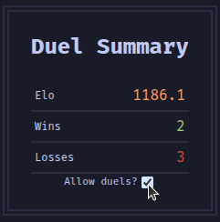

import {Aside, LinkButton, Steps} from "@astrojs/starlight/components";
import BadgeOverview from "../components/BadgeOverview.astro";

You can see your own usercard at https://bahms.org/usercard/.
Anyone may look up anyone's usercard.

<Aside type="tip">
    User cards can be viewed without logging in.
    Logging in with your Twitch account will allow you to configure settings
    specific to you.

    <LinkButton icon="setting" iconPlacement="start" href="#duel-summary">Opt out of duels</LinkButton>
</Aside>

## Profile

The first card shows profile information:

<Steps>
    1. [Your Bounce House Orb](/bahms/bounce-house/#profile-pictures)
    2. [Your name, as Jill sees you](/bahms/jill/#whispering)
    2. [Current Giga-VIP level](/giga-vip/)
    3. [Your acquired badges](#badges)
</Steps>

### Badges

After you acquire badges, you can find them on your usercard.
When hovering a badge, it will show a brief description of what the badge is for,
as well as the date on which you received the badge.

The following badges are available:

<BadgeOverview />

## Duel summary

The duel summary card will show your wins and losses in [duels](/bahms/duels/),
as well as your [ELO](/bahms/duels/#elo).

<Aside type="note">
    When logged in using Twitch, you can change whether you will allow someone
    to start a duel against you.

    

    This change is persisted immediately after checking or unchecking the box.
</Aside>

## Titles

Any [titles you unlocked](/bahms/sounds/#paid-sounds) can be seen on your usercard.