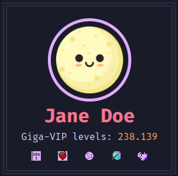
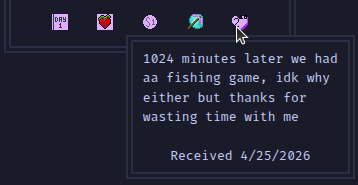
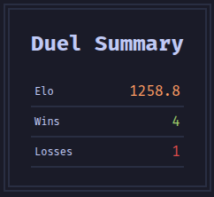
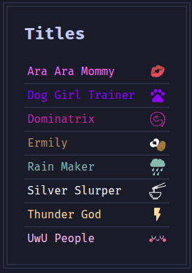

import {Steps} from "@astrojs/starlight/components";
import BadgeOverview from "../components/BadgeOverview.astro";

You can see your own usercard at https://bahms.org/usercard/.
Anyone may look up anyone's usercard.

## Profile

The first card shows profile information:

<Steps>
    1. [Your Bounce House Orb](/bahms/bounce-house/#profile-pictures)
    2. [Your name, as Jill sees you](/bahms/jill/#whispering)
    2. [Current Giga-VIP level](/giga-vip/)
    3. [Your acquired badges](#badges)
</Steps>

### Badges

After you acquire badges, you can find them on your usercard.
When hovering a badge, it will show a brief description of what the badge is for,
as well as the date on which you received the badge.

The following badges are available:

<BadgeOverview />

## Duel summary

The duel summary card will show your wins and losses in [duels](/bahms/duels/),
as well as your [ELO](/bahms/duels/#elo).

## Titles

Any [titles you unlocked](/bahms/sounds/#paid-sounds) can be seen on your usercard.